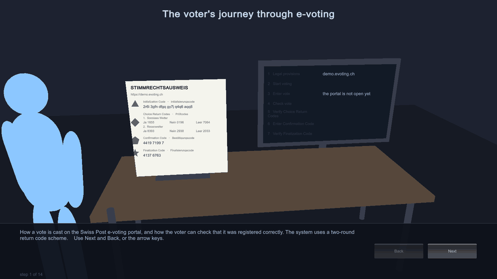

# E-Voting Walkthrough — Pixel Edition

An interactive, step-by-step explainer of how a vote is cast on the **Swiss Post e-voting
system** — and, more importantly, how a voter can verify that their vote was registered exactly as
they intended, even on a computer they do not trust.

Drawn as 16-bit style pixel art, generated entirely in code. No imported sprites, no texture files.



---

## What this is

A voter receives a **printed voting card** by post. The card carries codes that the voter's
computer cannot know. During voting, the portal sends codes back to the screen and the voter
compares them against the paper. If they match, the vote was registered correctly. If they do not,
something tampered with the vote and the voter stops.

That comparison is the heart of the system, and this walkthrough exists to make it obvious.
Fifteen steps, following the briefing's page order — including the security checks before starting,
the failure path when a code does not match, and the clean-up afterwards.

This is an **explainer, not a game**. See [Roadmap](#roadmap).

## Quick start

Requires **Unity 6000.5.9f1** — the version this project already targets. No extra packages.

1. Open the project in Unity Hub
2. Open the scene **`Assets/EVotingWalkthroughPixel/PixelWalkthrough.unity`**
3. Press **Play**, then **→** or **Next** to advance

The scene holds only a camera and one `PixelWalkthrough` component; the room, desk, monitor, card
and character are all built in `Awake`.

This is a slideshow, not an animation: each step holds until you advance. The character bobs and
the coin spins continuously, but the story only moves when you do.

### Controls

| Input | Action |
|---|---|
| `→` `Space` `Enter` or **Next** | Next step |
| `←` `Backspace` or **Back** | Previous step |
| `R` | Back to the first step |

## The art

Everything on screen is generated at runtime. Sprites are authored as rows of characters, one
character per pixel, mapped through a twenty-colour palette — the way console-era sprites were
drawn:

```
....KKKKKKK.....        K  outline
...KHHHHHHHK....        H  cap
...KSSSSSSSK....        S  skin
...KSKSSSKSK....        B  shirt
...KsSSSSSsK....        P  trousers
```

The voter is 16×24 pixels with two frames — idle, and pointing at whatever the current step is
about. The travelling message is an 8×8 coin with four frames of spin. Furniture is assembled from
pixel primitives (`Rect`, `Border`, `Dither`), which keeps the larger shapes editable.

Everything uses point filtering and integer pixel sizes, and the coin snaps to the pixel grid as it
flies, so nothing shimmers between pixels.

**One deliberate compromise.** The text uses a normal font rather than a bitmap one, because a 5×7
pixel font would make the explanatory paragraphs genuinely hard to read. This is an explainer first
and a pixel-art piece second.

The card's symbols are the printed ones — ▲ ◆ ● ★. The real card prints a filled *pentagon* for the
Bestätigungscode, but U+2B1F has no glyph in Unity's default font, so this uses the filled circle
the portal also uses for that step.

## The fifteen steps

Ordered as the briefing's pages, not as a summary of them.

| # | Step | What it shows |
|---|---|---|
| 1 | Explain Swiss Post E-Voting Through a Game | Cover, and the two-round scheme in one line |
| 2 | Two rounds, in sequence | The briefing's sequence diagram, written out |
| 3 | The voting card | Everything a card carries, from the briefing's list |
| 4 | Access the portal, then check the certificate | Typing the URL, and the full SHA-256 fingerprint |
| 5 | The recommended security checks | Certificate, **HTML/JS integrity**, add-ons, translation, codes, cache |
| 6 | Portal step 1 · Gesetzliche Bestimmungen | Both checkboxes, StGB Art. 279–283 |
| 7 | Portal step 2 · Stimmabgabe starten | Initialization Code + Geburtsjahr 1980 |
| 8 | Portal step 3 · Stimme erfassen | Weather **and** Variantenabstimmung selections |
| 9 | Portal step 4 · Stimme kontrollieren | Review, then the encrypt-and-send dialog |
| 10 | Portal step 5 · Prüfcodes verifizieren | **The key step** — four returned codes against page 2 of the card |
| 11 | Portal step 5 · If a code does not match | **The failure path** — abort, contact the canton |
| 12 | Portal step 6 · Bestätigungscode eingeben | The step that actually casts the vote |
| 13 | Portal step 7 · Finalisierungscode verifizieren | Match, and the process is complete |
| 14 | Stopping and resuming | The three cases, from the briefing verbatim |
| 15 | After voting · Browserdaten löschen | Cookies and cache, and when it is unnecessary |

Full detail, with sources, in **[docs/voting-process.md](docs/voting-process.md)**.

## Terminology

The Swiss Post documentation uses **two different sets of names** for the same four codes. This
project uses the names a voter actually sees on the portal:

| Used here (portal) | Also called (System Specification v1.6.1) |
|---|---|
| ▲ Initialisierungscode / Initialization Code | Start Voting Key |
| ◆ Prüfcodes / Choice Return Codes | Choice Return Codes |
| ● Bestätigungscode / Confirmation Code | Ballot Casting Key |
| ★ Finalisierungscode / Finalization Code | Vote Cast Return Code |

If you pull text from the specification or from `Security-advices/`, translate the names so the
walkthrough stays internally consistent.

## Project structure

The walkthrough is self-contained under one folder and touches nothing else in the project.

```
Assets/EVotingWalkthroughPixel/
  Scripts/
    PixelWalkthrough.cs        All fifteen steps, scene, animation, text
    Ballot.cs                  The demo ballot and every printed Choice Return Code
    PixelArt.cs                Palette, sprite building, pixel drawing primitives
    PixelSprites.cs            The art: character, coin, card, monitor, desk, tiles
    PixelScreenshotCapture.cs  Documentation screenshot pass (-capture flag)
  Editor/
    PixelWalkthroughBuild.cs   Scene creation and headless build
docs/
  voting-process.md            The documented process, with sources
  sources.md                   Where every fact came from
  development.md               Architecture, editing content, building, regenerating images
  screenshots.md               All fifteen steps as images
  screenshots/                 One PNG per step (generated)
  walkthrough.gif              All steps as an animation (generated)
tools/
  make_gif.py                  Assembles the GIF from the screenshots
```

The rest of the repository is the Unity URP starter project from the initial commit. The
walkthrough does not use or modify it.

### Editing the content

Everything a reader sees lives in one array: `BuildSteps()` in
`Assets/EVotingWalkthroughPixel/Scripts/PixelWalkthrough.cs`. Each entry is one step — title,
explanatory paragraph, the lines on the monitor, which card row to highlight, and which way the
coin travels. Adding a step means adding one entry.

To change the art, edit the character grids in `PixelSprites.cs` or add colours to the palette in
`PixelArt.cs`.

## Two things worth knowing about this project

- **Universal Render Pipeline.** Sprites render fine, but any material built from the Built-in
  `Standard` shader would come out **magenta**.
- **Input System package only** (`activeInputHandler: 1`). The legacy `Input.GetKey` API throws at
  runtime; input goes through `Keyboard.current`.

Details in [docs/development.md](docs/development.md).

## Documentation

| Document | Contents |
|---|---|
| [docs/voting-process.md](docs/voting-process.md) | The full process, the security checks, and the system's stated limits |
| [docs/sources.md](docs/sources.md) | Every source, and the terminology discrepancy between them |
| [docs/development.md](docs/development.md) | Architecture, editing content, building, regenerating images |
| [docs/screenshots.md](docs/screenshots.md) | All fifteen steps as images |

## Sources

Content is drawn from Swiss Post's public disclosure at
[gitlab.com/swisspost-evoting](https://gitlab.com/swisspost-evoting) and from the "Explain Swiss
Post E-Voting Through a Game" briefing. Every claim is traced to a file in
**[docs/sources.md](docs/sources.md)**.

The live demo portal is at [demo.evoting.ch](https://demo.evoting.ch) — download a fresh voting card
per session, and authenticate with birth year **1980**.

## Other versions

This repository carries the same walkthrough in three renderings, on separate branches:

| Branch | Rendering |
|---|---|
| `evoting-walkthrough-pixel` | **This one** — 16-bit pixel art, fixed side-on view |
| `evoting-walkthrough-3d` | 3D desk scene with a camera that moves between card and monitor |
| `evoting-walkthrough` | Flat 2D, in a separate standalone Unity project |

The content and sources are identical; only the presentation differs.

## Roadmap

The obvious next step is turning the explainer into the game the briefing asks for. The mechanic is
already implied by step 9: show the code the portal returned, and let the player find the match on
the card — with some rounds where the codes *deliberately do not match*, and the correct answer is
to stop and report it. That one interaction teaches the entire trust model.

Further ideas, in rough order of value:

- A walk cycle, so the character moves between the card and the desk rather than standing still
- A proper 5×7 bitmap font, so the interface matches the art
- Verifying JavaScript hash values and system time (the two advanced security checks not yet covered)
- The counting phase and the independent Verifier — the "universal verifiability" half of the story
- German / French / Italian / Romansh text (the source security advice already exists in all four)

## Status

Explainer complete and verified to build cleanly. Not yet reviewed by anyone with Swiss Post
e-voting expertise — corrections very welcome.

## Licence

Not yet chosen. **Add a licence before making this repository public.** The reference material
described in `docs/sources.md` belongs to Swiss Post and is published under their own terms; this
walkthrough contains only original code and original prose describing their public documentation.
