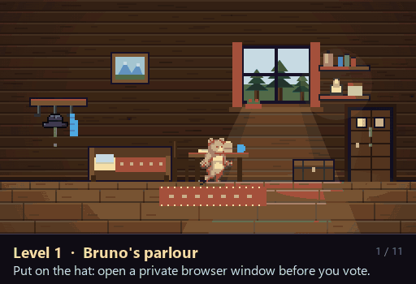

# Brunos Code-Abenteuer

A 2D pixel adventure that teaches the Swiss Post e-voting security steps by making
you perform them. Built for the BärnHäckt hackathon.



Bruno the bear walks the same checks a voter walks. He does not read about
verification; he holds a code sheet, compares a number, and finds out what happens
when he skips the comparison. Every puzzle is a real step, and every failure is a
real threat.

| | |
|---|---|
| **Runs** | in any modern browser. No build, no framework, no dependencies |
| **Languages** | German, French, Italian |
| **Size** | ~4,400 lines of JavaScript across nine modules |
| **Input** | keyboard, mouse, or touch |

## Play it

Because the browser blocks image loading from `file://`, serve the folder:

```bash
python -m http.server 8000
```

Then open <http://localhost:8000>. Without real assets it also runs from a plain
double-click on `index.html`, falling back to code-drawn placeholders.

**Controls** — `A`/`D` or arrows to walk, `Space`/`W`/`↑` to jump, `E`/`Enter` to
use and to advance dialogue, `1`–`4` to choose, `G` for the code sheet, `Esc` for
the menu. Any key skips a level wipe. Top left toggles sound, effects, music and
learn cards.

## Documentation

| Document | What it covers |
|---|---|
| [Motivation](docs/01-MOTIVATION.md) | Why a game, when a leaflet already exists |
| [Objectives](docs/02-OBJECTIVES.md) | The learning outcomes, and how to tell if they landed |
| [Symbols and meaning](docs/03-SYMBOLS-AND-MEANING.md) | What every object in the world stands for |
| [Goal of the gamification](docs/04-GOAL-OF-GAMIFICATION.md) | The pedagogical design, and its limits |
| [Mapping to e-voting](docs/05-MAPPING-TO-E-VOTING.md) | The 1:1 correspondence, which is not negotiable |
| [How it builds trust](docs/06-HOW-IT-BUILDS-TRUST.md) | Why understanding a process is what makes it trustworthy |
| [Architecture](docs/07-ARCHITECTURE.md) | What each file does, and how a frame is drawn |

## The idea in one table

Every mechanic is a real step. This table is generated from the same strings the
game shows the player in its closing panel, so the documentation cannot drift from
what is taught.

| In the game | Real e-voting step | Threat it defeats |
|---|---|---|
| The hat | Private browser window | Extensions reading along |
| The code sheet | Voting card | — |
| The boat number | Verifying the voting card | Forged or stolen card, phishing |
| The pattern | Initialisation code | Someone opening a session in your name |
| The status value | Choice Return Codes | Your vote altered in transit |
| The confirmation code | Confirmation Code | A vote cast without your intent |
| The final star | Finalisation code | An incomplete vote nobody notices |
| Sweeping the tracks | Clearing history and cache | Traces left on a shared device |

## Repository layout

```
index.html      shell: topbar, touch bar, title, live region
style.css       panels, buttons, code sheet, menu, label layer
core.js         canvas, CONFIG, prefs, palette, sound, music, particles
i18n.js         DE/FR/IT strings and tr()
labels.js       DOM text layer positioned in game coordinates
pixart.js       hand-drawn sprites and the procedural gate
engine.js       asset manifest and loader, animation, state, sequences, input
draw.js         drawing helpers, Bruno, the sword, static layers
scenes.js       scene backdrops, enemies, the star finale, the rune tower
story.js        the code sheet, scenes, dialogue, menu, learn cards, update()
main.js         frame loop, fitCanvas, boot, touch controls
assets/         sprite sheets, backgrounds, audio
tools/          asset preparation scripts (Pillow only)
HANDOFF.md      the running development log, in German
```

## A note on the demo values

The demo constants are fixed on purpose: code `2r6i 3gfn dfqq 9y7j q4q6 aqq8`,
birth year 1980. They exist so a presenter can rehearse a run. They are not real
credentials and correspond to no real ballot.
