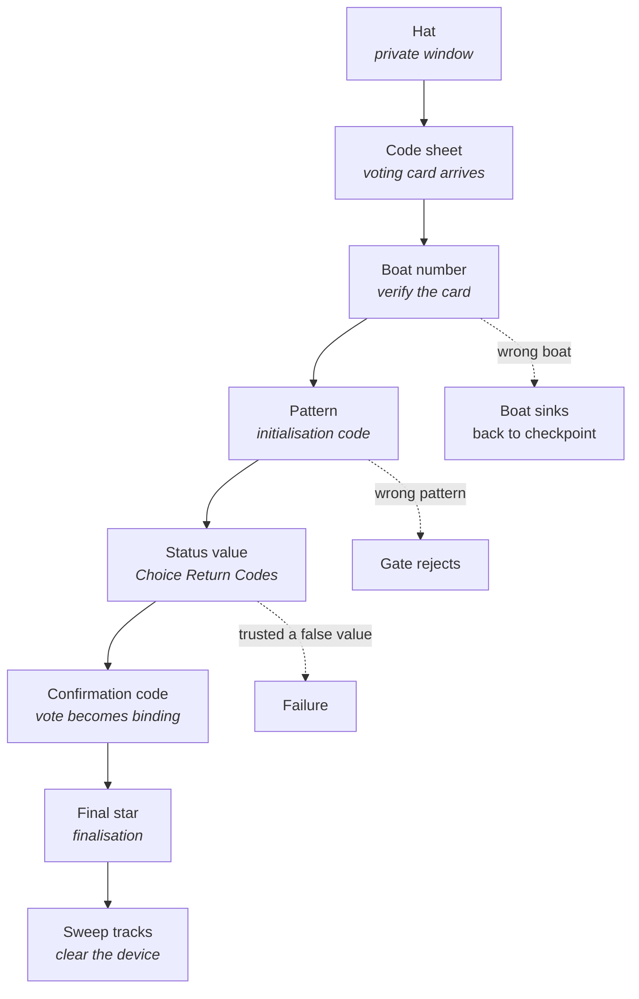

# Mapping to e-voting

**This mapping is the one part of the design that does not bend.** Art, dialogue,
level layout and difficulty are all open. If the fiction and the real process ever
disagree, the fiction changes.

The table below is the same content the game shows the player in its closing panel
(the `map.*` strings in `i18n.js`). Keeping the documentation and the game reading
from one source is deliberate: a mapping that drifts is worse than no mapping,
because it teaches confidently wrong things.

## The table

| # | In the game | Real e-voting step | Threat it defeats |
|---|---|---|---|
| 0 | **The hat**, taken from the hook before leaving | Opening a **private browser window** before the portal | An extension or a previous session reading along |
| 1 | **The code sheet**, from the mailbox | The **voting card** delivered by post | — (this is the anchor, not a check) |
| 2 | **The boat number** on the jetty post | **Verifying the voting card** before starting | A forged or stolen card; phishing |
| 3 | **The pattern** carved into the gate | The **initialisation code** | Someone opening a session in your name |
| 4 | **The status value** on the guardian's device | The **Choice Return Codes** | Your vote altered in transit, or recorded differently than intended |
| 5 | **The confirmation code** at the rune tower | The **Confirmation Code** | A vote made binding without your conscious act |
| 6 | **The final star** in the star chamber | The **finalisation code** | An incomplete submission that raises no error |
| 7 | **Sweeping the footprints** | Clearing **history, cache and cookies** | Traces on a shared device readable by whoever is next |

## The order matters as much as the items

The sequence is not arbitrary and the game enforces it, because in reality each
step is worthless out of order.

Three orderings are load-bearing:

- **The hat comes first.** A private window opened after you have already visited
  the portal protects nothing. So the door will not let Bruno out without it.
- **Verification precedes commitment.** The boat number is checked before
  boarding, not after; the pattern before the gate opens.
- **Confirmation precedes finalisation.** Choosing is not casting, and casting is
  not completing. Three separate moments, three separate places in the game.

## The two steps that carry the most weight

### The status value is the crux

Choice Return Codes are the least intuitive idea in real e-voting: **the system
tells you what it recorded, and your job is to disbelieve it until paper agrees.**
Every instinct says a computer reporting its own state is authoritative.

The game attacks this directly. The guardian's device is wrong roughly half the
time, and the player answers *Stimmt* / *Falsch*. Trusting the readout is a losing
strategy discovered by losing. No wording achieves this.

If you change one thing about this game, do not change that.

### Confirmation and finalisation are different steps

They were one visual — two identical gates — and players remembered them as the
same obstacle twice. That is a mapping failure: it taught that casting and
completing are one act, when a vote stuck between them is exactly the quiet failure
finalisation exists to catch.

Rebuilt in v15 as a rune tower at night, visually unrelated to the daylight gate.
**The fiction changed because the mapping could not.**

## What is deliberately not mapped

Included so nobody reads meaning into scenery:

| In the game | Stands for |
|---|---|
| The spider, the crocodile | Nothing. Obstacles that make the status value worth reaching |
| The sword | Nothing specific. Loosely "the means to proceed" |
| Checkpoints, retries | Nothing. Real verification has no lives |
| The broom | Only the sweeping action; the tool itself means nothing |
| Bern, the bear, the alps | Setting. They place the subject, they do not encode it |

## Rules for changing this file

1. **The game's `map.*` strings and this table say the same thing.** Change both,
   or neither.
2. **A new mechanic gets a row or gets declared scenery.** No unlabelled
   in-between.
3. **If a symbol behaves unlike its real counterpart, the symbol is wrong.** The
   code sheet cannot be reissued because a voting card cannot be reissued.
4. **Nothing here implies a security guarantee.** This is a teaching aid. It
   verifies nothing and protects no one on its own.

---

Previous: [Goal of the gamification](04-GOAL-OF-GAMIFICATION.md) · Next: [How it builds trust](06-HOW-IT-BUILDS-TRUST.md)
