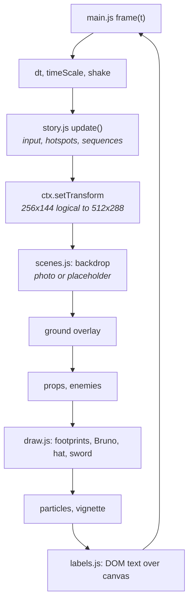

# Architecture

No build step, no framework, no dependencies. `index.html` loads nine scripts in a
fixed order and they populate the global scope. That is unfashionable and it is
the right call for a hackathon artefact: anyone can open a file and change a
number, and the thing runs from a folder for as long as browsers run JavaScript.

**Load order is the dependency graph.** Each file may use what earlier files
defined. Reordering the `<script>` tags breaks it.

## What each file does

| # | File | Lines | Responsibility |
|---|---|---|---|
| 1 | `core.js` | 431 | Canvas and rendering scale, `CONFIG`, preferences, palette, sound, music, screen shake, particles, vignettes |
| 2 | `i18n.js` | 376 | DE/FR/IT string tables, `tr(key, params)`, `setLanguage()` |
| 3 | `labels.js` | 103 | DOM text layer positioned in game coordinates |
| 4 | `pixart.js` | 339 | Hand-drawn sprites (`PIX`, `drawPix`, `pixIcon`) and the procedural gate |
| 5 | `engine.js` | 438 | `ASSET_MANIFEST`, asset loader, `Anim`, `drawSprite`, game state, sequences, input |
| 6 | `draw.js` | 380 | Drawing helpers, Bruno, the sword, the hat, static layer caching |
| 7 | `scenes.js` | 927 | Every scene backdrop, enemies and corpses, the boats, the rune tower, the star finale |
| 8 | `story.js` | 928 | The code sheet, scene definitions, dialogue, menu, learn cards, checkpoints, `update()` |
| 9 | `main.js` | 125 | `frame()` loop, `fitCanvas()`, boot, touch controls |

Plus `index.html` (58 lines — shell, topbar, touch bar, live region) and
`style.css` (260 — panels, buttons, code sheet, menu, label layer).

### `core.js` — the foundation

Owns the canvas and the two-times render scale: the game is drawn at **512×288**
while every drawing routine still thinks in **256×144**. `RES = 2` and a
per-frame `ctx.setTransform` do the conversion, so sprites stay on the 256 grid
while circles, rotations and lines get the finer resolution.

`CONFIG` is the tuning block — walk speed, gravity, jump velocity, fade and wipe
times, particle cap, music volume and crossfade. Start here to change feel.

Also holds `Prefs` (localStorage, wrapped in try/catch), the palette, `Sfx`
(synthesised through the Web Audio API — no sound files), and `Music` (which since
v13 plays real files from `assets/audio/` through `<audio>` elements, with
`SCENE_MUSIC` as the only mapping you need to touch).

### `i18n.js` — three languages

Every player-facing string, keyed. `tr(key, params)` looks up the current
language. Dialogue and choices take keys rather than text, so switching language
mid-run re-renders what is already on screen.

**This file is also the source of truth for the teaching content.** The `map.*`
entries are the game-to-real-step table, and `learn.*` holds each step's
explanation and averted threat. [The mapping document](05-MAPPING-TO-E-VOTING.md)
mirrors these deliberately.

### `labels.js` — text that stays sharp

Canvas text at this scale looks soft, so there is none. Level signs, boat numbers,
signposts and the closing title are DOM elements positioned in game coordinates
over the canvas, including wipe clipping and shake.

*Consequence worth knowing:* text does not appear in canvas captures. The
explainer GIF's captions were composited separately for this reason.

### `pixart.js` — sprites drawn in code

Pixel art defined as data and rasterised at load: mailbox, boats, wreck, scroll,
signposts, skull and bones, lanterns, symbols, star, broom. Results are cached.
The first gate is drawn procedurally so its doors can swing on `openK`.

### `engine.js` — assets, animation, state, input

`ASSET_MANIFEST` declares every animation (`src`, `frames`, `fps`, `w`, `h`,
`loop`). The loader fetches each file **once** even when several keys share a
sheet, and falls back to code-drawn placeholders when a file is missing — which is
why the game ran before any art existed.

`Anim` plays frame-based animations; `loopFrame(key)` derives a frame straight
from game time for background figures that need no state.

`playSequence()` runs one-shot animations that pause the game — attacks, deaths,
the gate opening, a star shattering. The next story step waits for the sequence to
finish.

Input fills a `keys` map keyed by `event.code`.

### `draw.js` — Bruno and the helpers

Draws Bruno, his sword (`HAND` gives the paw anchor per animation frame, so the
sword sits in the paw and moves with it), the hat overlay (`HAT_OFF` per frame),
and footprints.

Also `staticLayer(key, fn)`, which renders unchanging scenery once into an
offscreen canvas. Only water, clouds, smoke and glow are redrawn live.

### `scenes.js` — the world

The largest visual file. Each scene function is three layers:

1. **Backdrop** — the photographic background from `assets/bg/` if loaded,
   otherwise the code-drawn placeholder. Landscape only.
2. **Ground overlay** — water and jetty at the river, `stoneFloor()` at the gates,
   the evening gradient at the end.
3. **Props** — always drawn: chalet, mailbox, signs, boats, altar, gate, rune
   tower, enemies, stars, broom, Bruno.

Since v15 the rune tower lives here: `TOWER_RUNES` (nine arch keystones, four
wall, two floor slabs, each pulsing on its own phase), `towerDoor()`, and
`towerConsole()`, which lights as Bruno approaches.

### `story.js` — the game itself

The state machine. Holds `PATTERNS`, `STARS` and `STATUS_POOL`; `rollCodeblatt()`
re-rolls the sheet's values each playthrough so answers cannot be memorised.

Defines all eleven scenes with their hotspots, dialogue, choices and consequences;
the code sheet modal; the menu; learn cards; and `recordCheckpoint()` /
`respawnAtCheckpoint()`, which is why a wrong answer costs a scene and never the
run.

### `main.js` — the loop

`frame()` advances time, applies shake, draws, and requests the next frame.
`fitCanvas()` scales to whole screen pixels per render pixel and sets `--gs` so
the label layer tracks. Boot wiring and touch controls.

## How one frame is drawn

## Where to change things

| To change | Go to |
|---|---|
| Walk speed, jump, gravity, timings | `CONFIG` at the top of `core.js` |
| Any player-facing text, or a translation | `i18n.js` |
| The teaching content or a threat description | `i18n.js`, `learn.*` and `map.*` |
| Which track plays where | `SCENE_MUSIC` in `core.js` |
| A new animation or sprite sheet | `ASSET_MANIFEST` in `engine.js` |
| Scene layout, hotspots, dialogue | `story.js` |
| How a scene looks | `scenes.js` |

## Tools

`tools/` holds Pillow scripts used to prepare assets. They are **not** needed to
run the game.

- `gif2sheet.py` — GIF, PNG sequence or existing sheet into a horizontal sprite
  sheet: extracts frames, removes background, restores native pixel resolution,
  hardens the alpha edge, and prints the `ASSET_MANIFEST` line to paste.
- `prepare_bg.py` — aligns a background so its ground line lands on `groundY`.
- `make_boat.py`, `make_tower.py` — generate those two props.

## Known rough edges

Carried from `HANDOFF.md` rather than quietly dropped:

- `bruno_walk`, `bruno_attack`, `bruno_hit`, `bruno_death` and `bruno_cheer` all
  still point at the idle sheet. Real GIFs through `gif2sheet.py` would replace
  them without touching code.
- `spider_hit/defeated` and `croc_hit/defeated` reuse the idle sheet at different
  frame rates; the twitching and toppling come from transforms.
- `sterne.wav` is 34.6 MB uncompressed, against 2.6–3.9 MB for the five MP3s.
  Encoding it to MP3 would remove roughly 32 MB from the repository.
- `HANDOFF.md` is the development log, in German, and is the most detailed record
  of why individual decisions were made.

---

Previous: [How it builds trust](06-HOW-IT-BUILDS-TRUST.md) · [Back to README](../README.md)
