# Screenshots

One image per step, generated by the capture pass — see
[development.md](development.md#regenerating-the-screenshots-and-the-gif).
Do not edit these by hand; regenerate them after changing a step.

All steps as an animation: [walkthrough.gif](walkthrough.gif)

### 1. the voter s journey through e voting

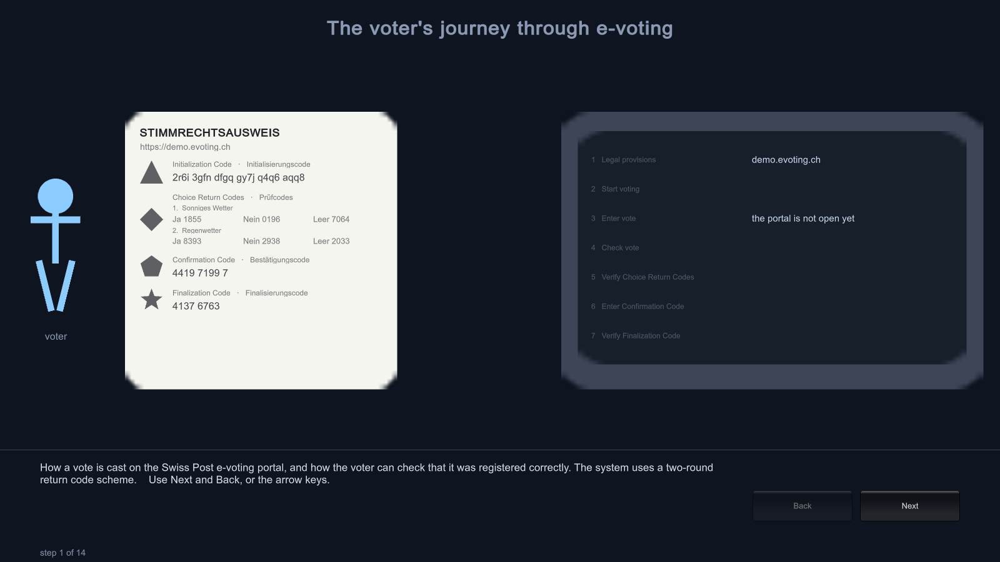

### 2. the voting card arrives by post

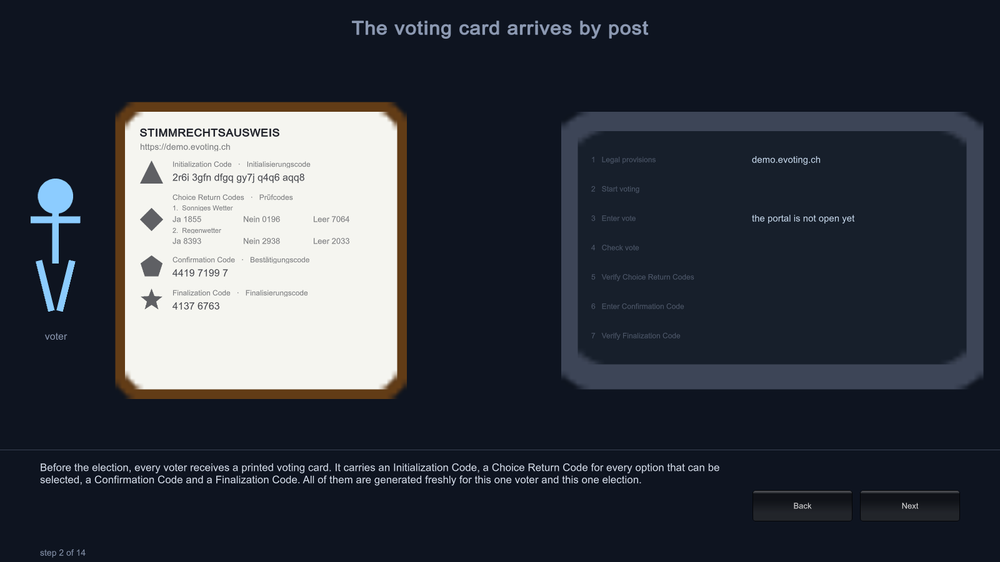

### 3. before starting am i on the real portal

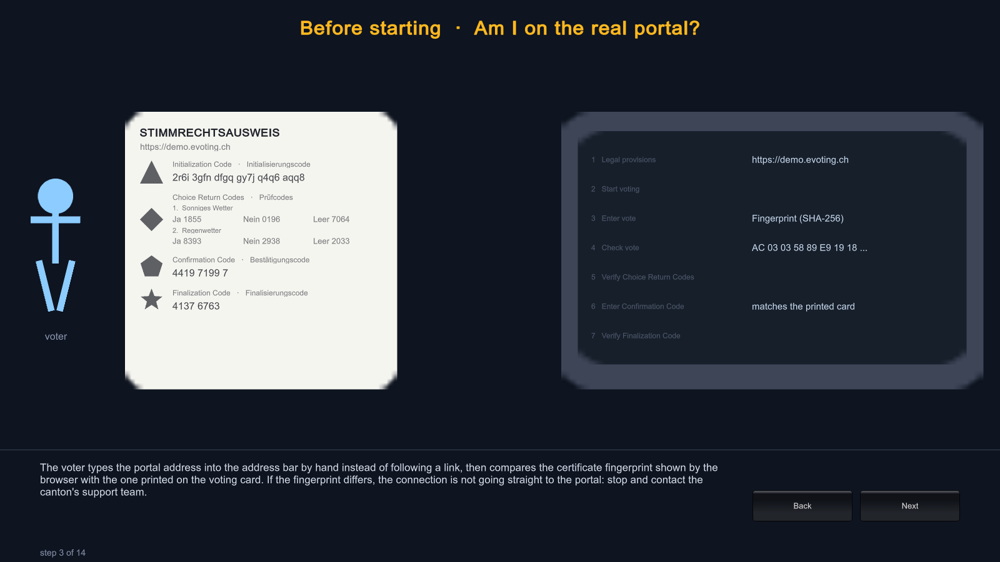

### 4. before starting a browser without add ons

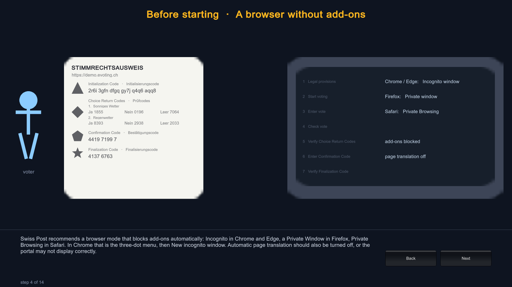

### 5. portal step 1 legal provisions

### 6. portal step 2 start voting

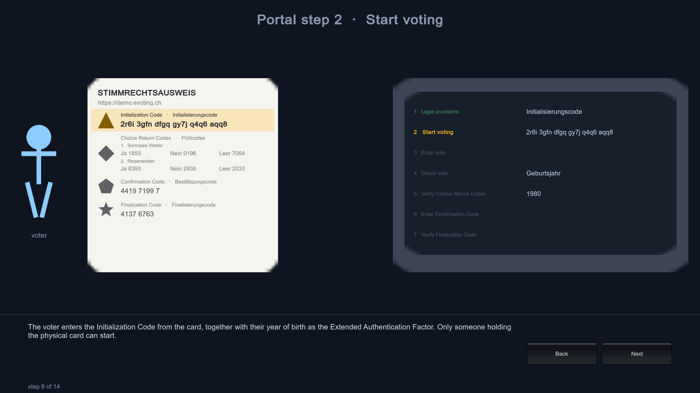

### 7. portal step 3 enter the vote

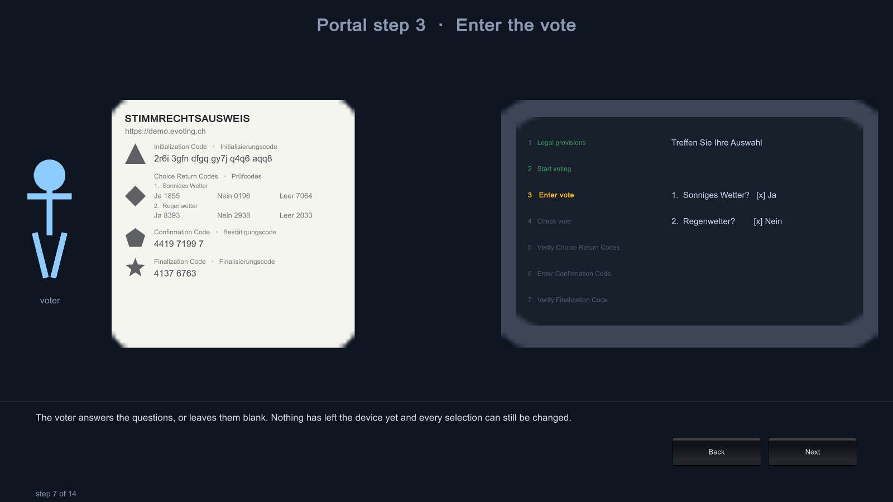

### 8. portal step 4 check the vote then send it

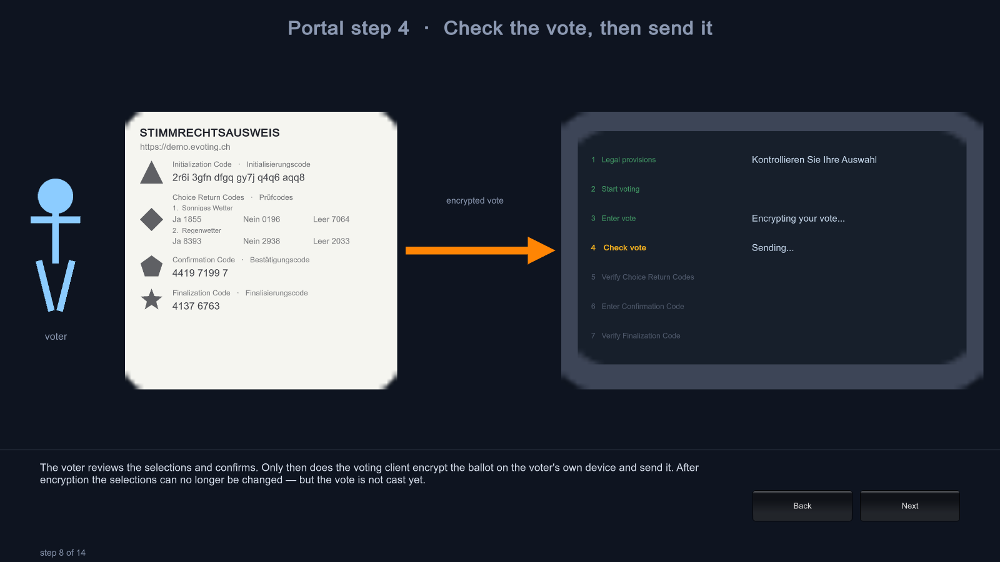

### 9. portal step 5 verify the choice return codes

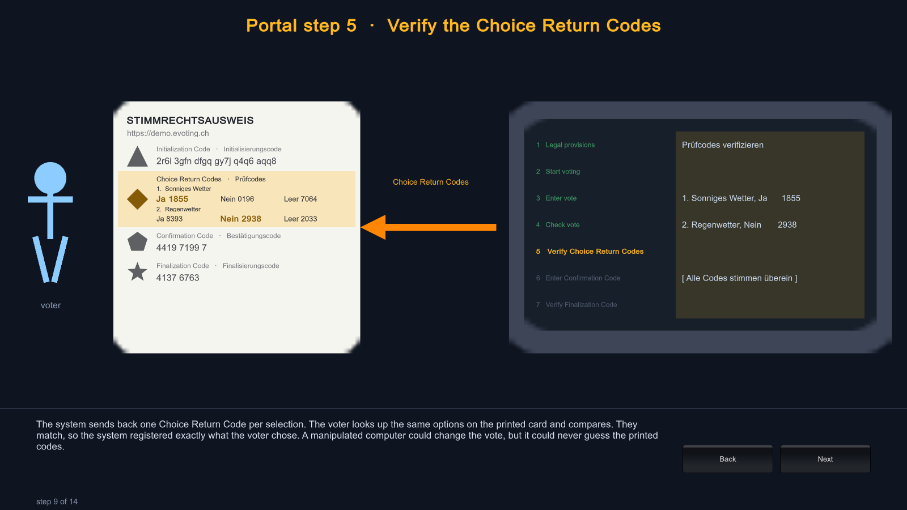

### 10. portal step 6 enter the confirmation code

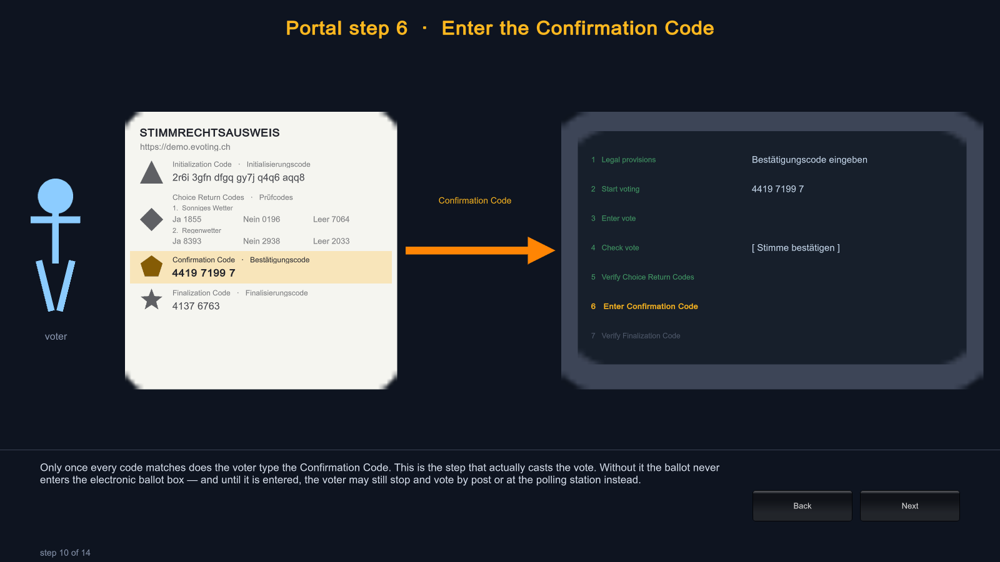

### 11. portal step 7 verify the finalization code

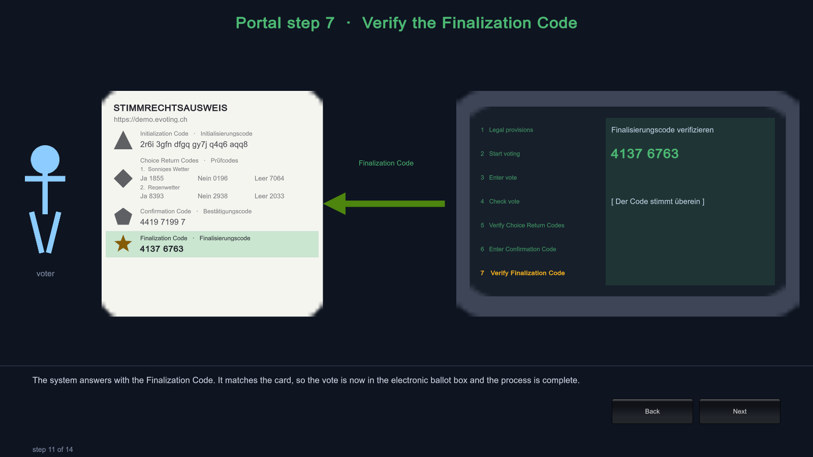

### 12. stopping and resuming

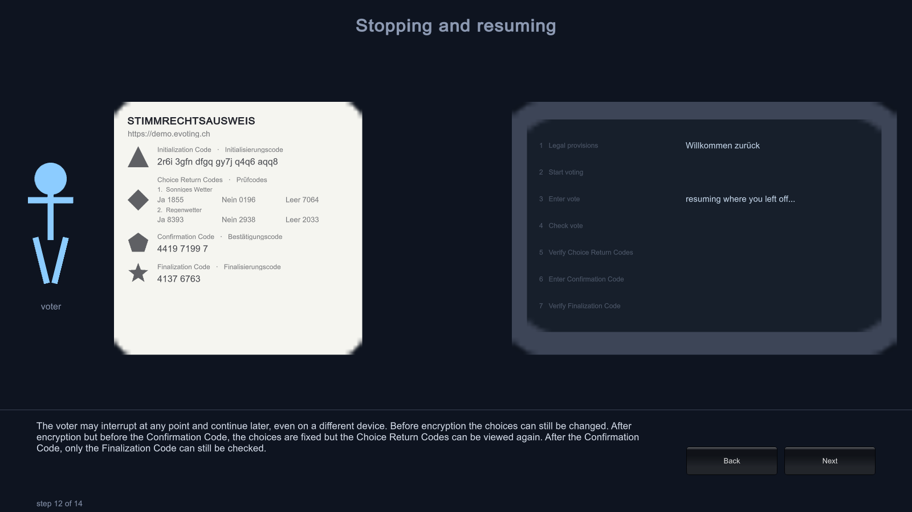

### 13. after voting clearing the traces

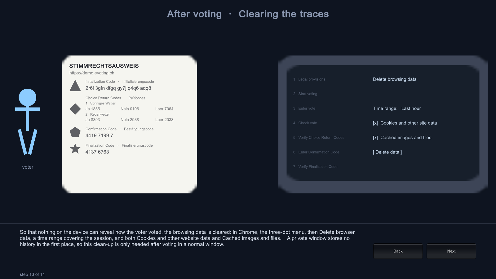

### 14. why this is trustworthy

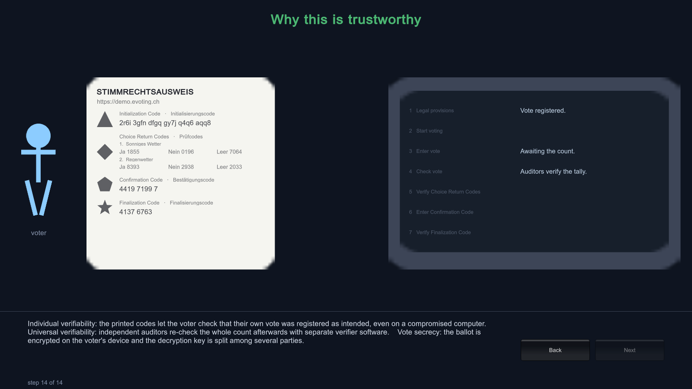
