# Screenshots

One image per step, generated by the capture pass — see
[development.md](development.md#regenerating-the-screenshots-and-the-gif).
Do not edit these by hand; regenerate them after changing a step.

All steps as an animation: [walkthrough.gif](walkthrough.gif)

### 1. explain swiss post e voting through a game

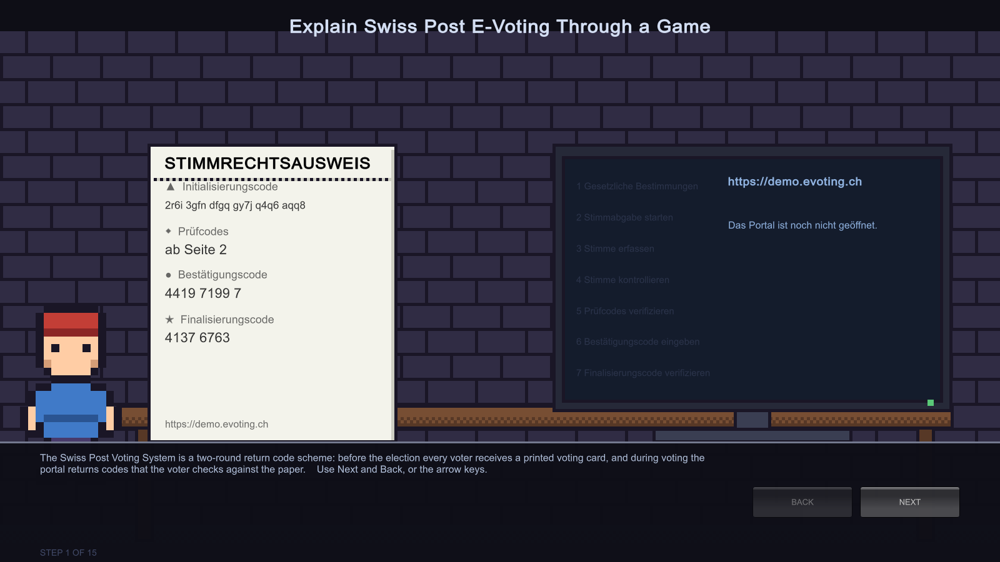

### 2. two rounds in sequence

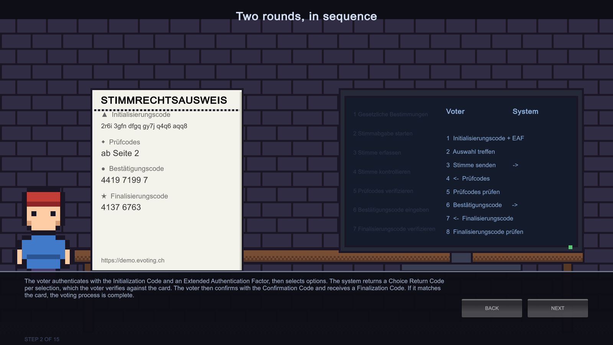

### 3. the voting card

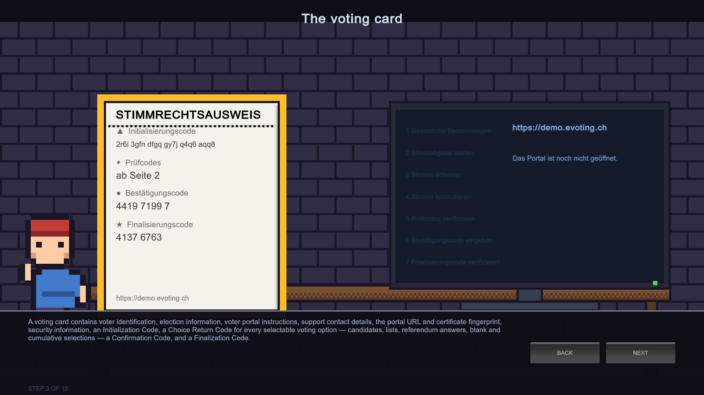

### 4. access the portal then check the certificate

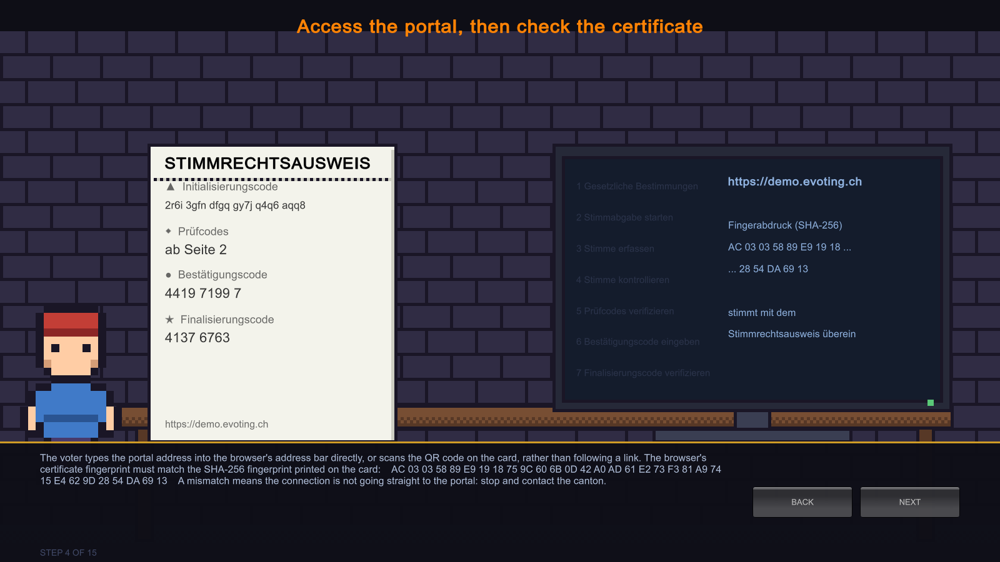

### 5. the recommended security checks

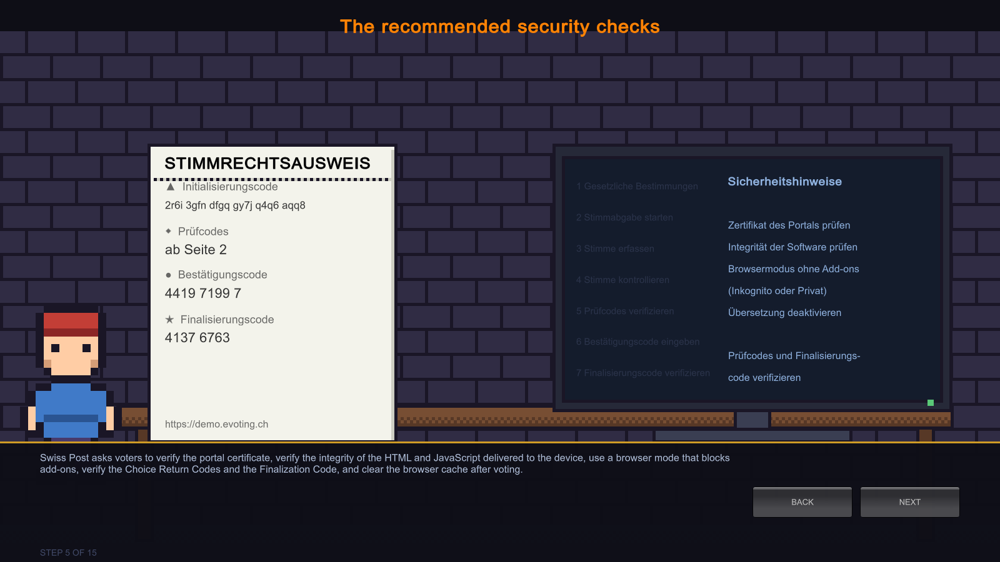

### 6. portal step 1 legal provisions

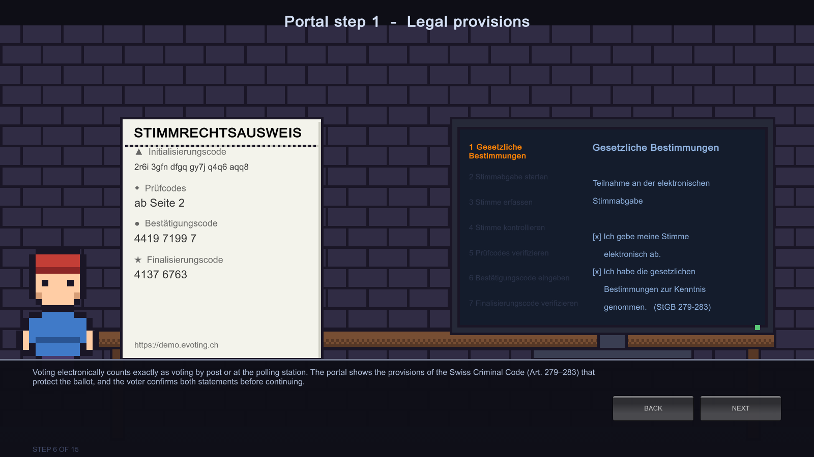

### 7. portal step 2 start voting

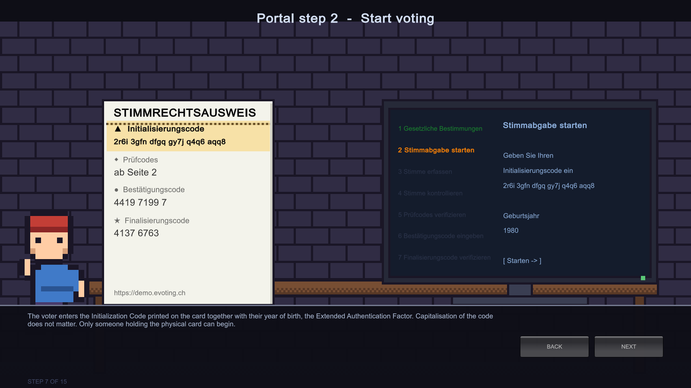

### 8. portal step 3 enter the vote

### 9. portal step 4 check the vote then send it

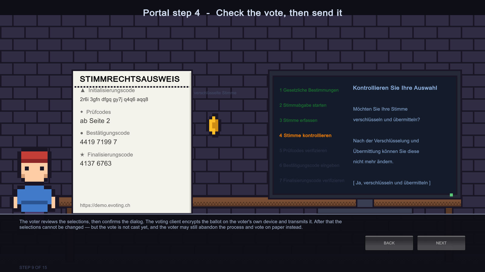

### 10. portal step 5 verify the choice return codes

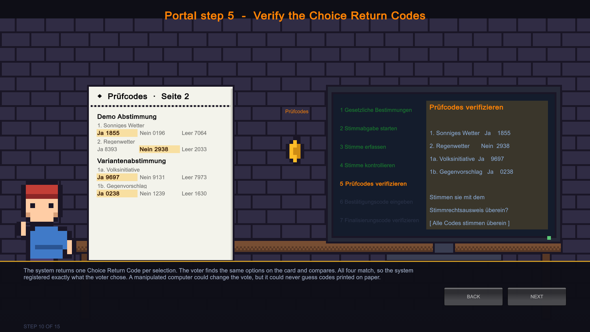

### 11. portal step 5 if a code does not match

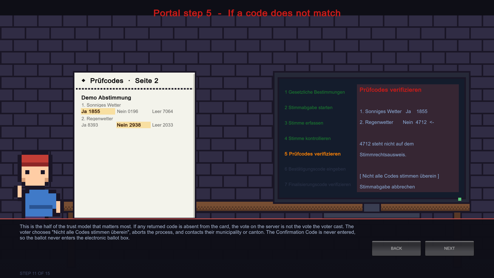

### 12. portal step 6 enter the confirmation code

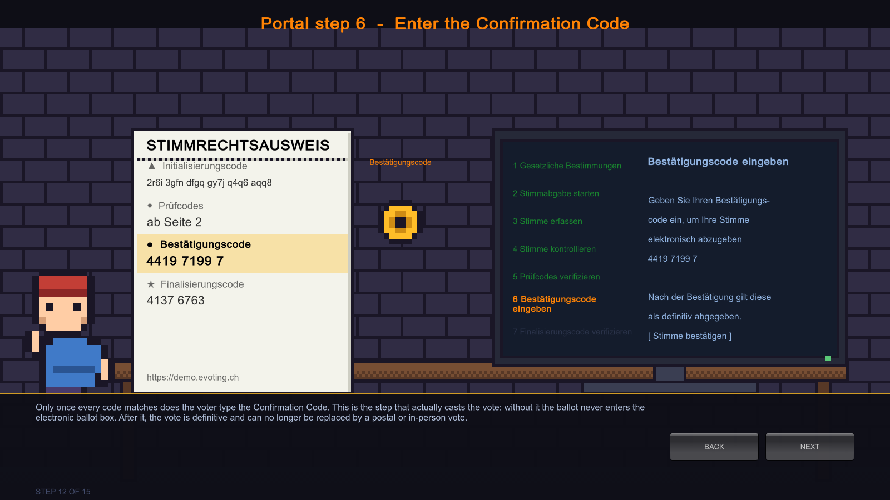

### 13. portal step 7 verify the finalization code

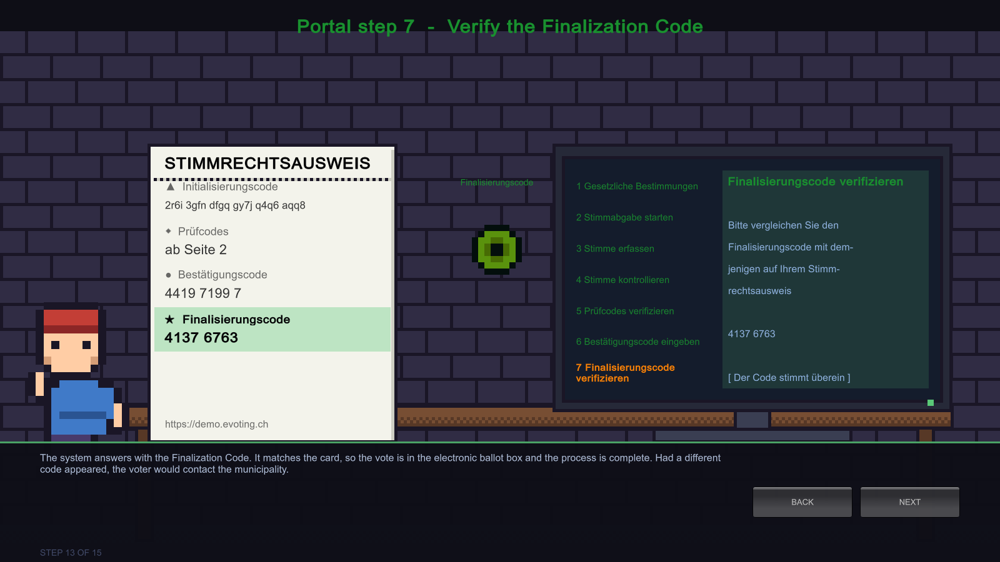

### 14. stopping and resuming

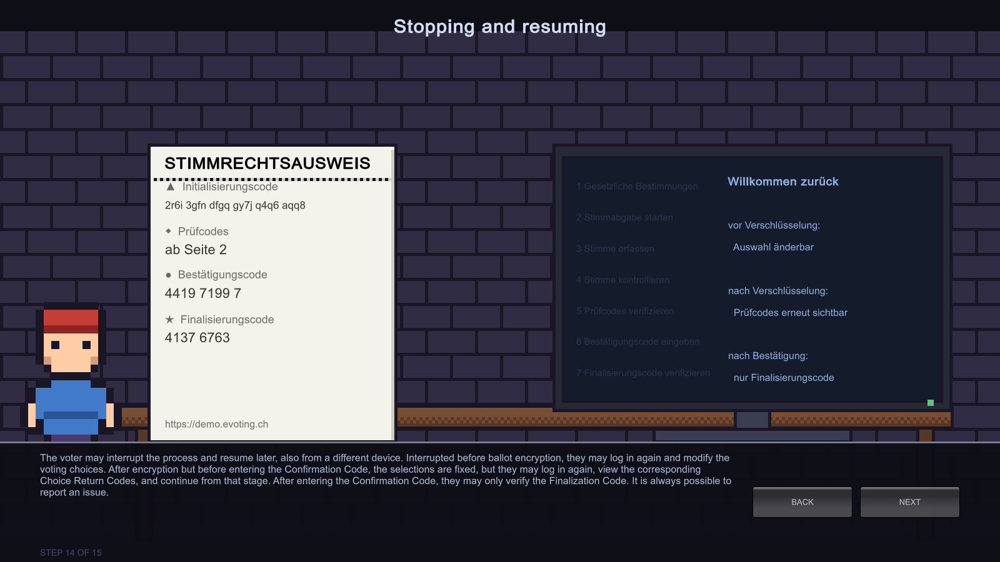

### 15. after voting clearing the traces

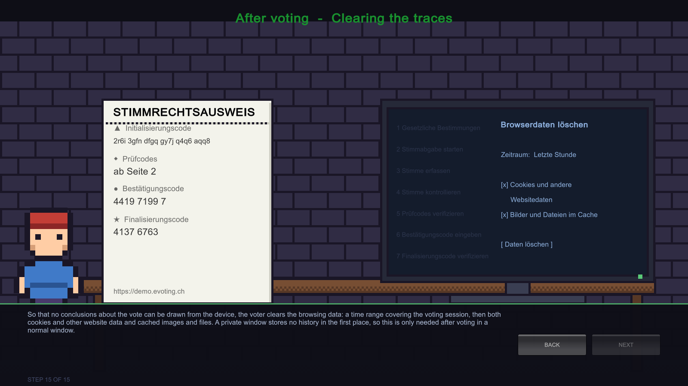
